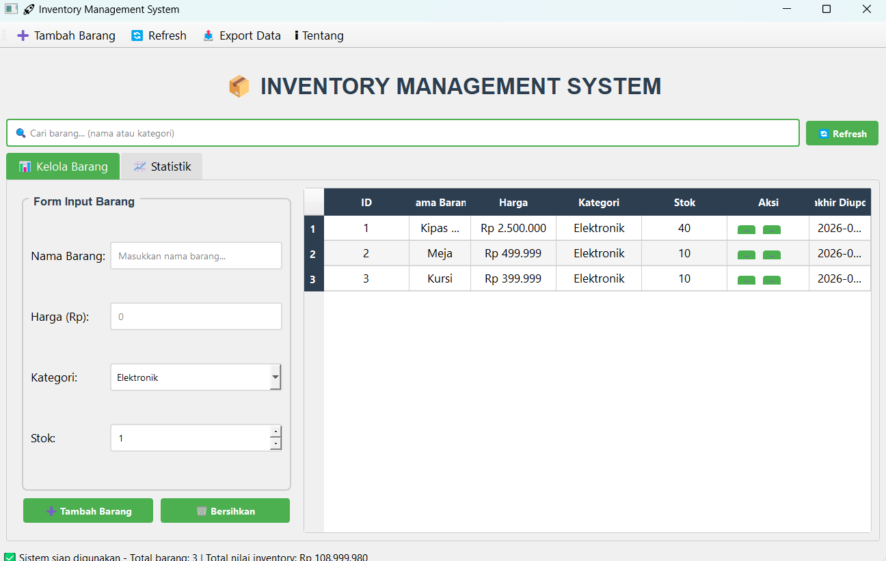
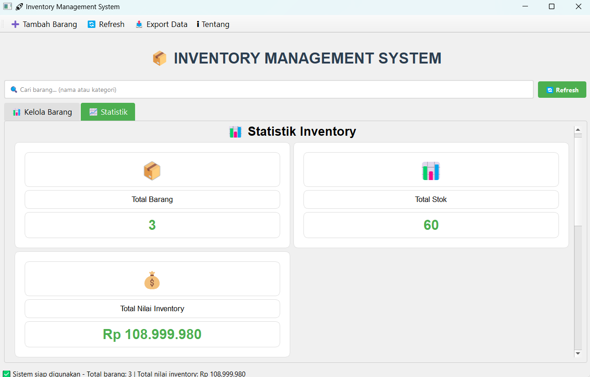
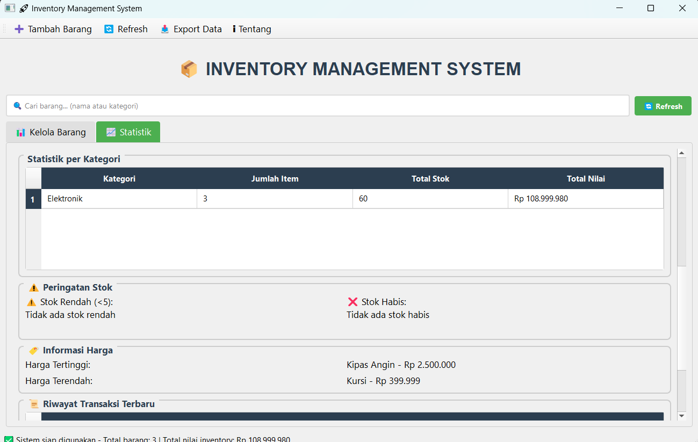
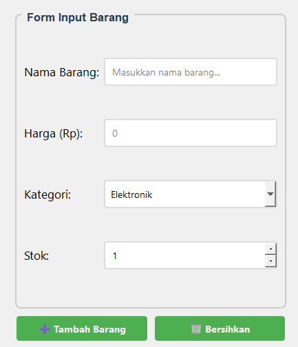
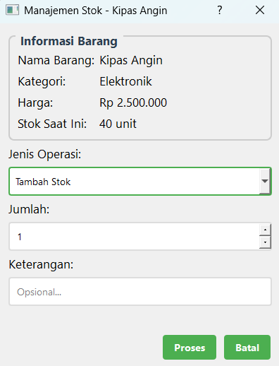
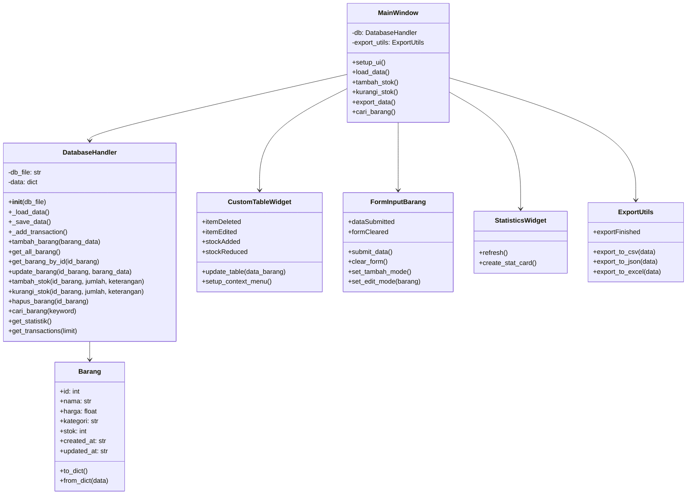
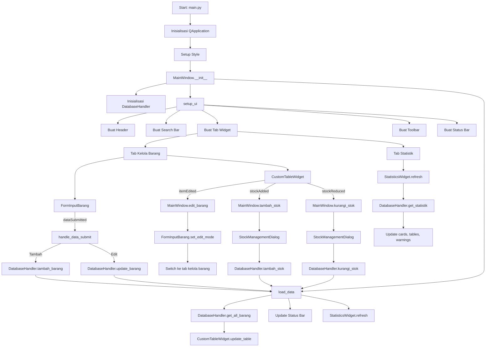

# 📦 Inventory Management System

<div align="center">


**Sistem manajemen inventory modern dengan fitur lengkap untuk mengelola stok barang, transaksi, dan analisis data**

</div>

## 📋 Deskripsi Proyek

**Inventory Management System** adalah aplikasi desktop berbasis PyQt5 yang dirancang untuk membantu bisnis atau individu dalam mengelola inventaris barang secara efisien. Aplikasi ini menyediakan solusi lengkap untuk manajemen stok, pencatatan transaksi, serta analisis data inventory dengan antarmuka yang modern dan user-friendly.

Sistem ini memungkinkan pengguna untuk melakukan operasi CRUD (Create, Read, Update, Delete) pada data barang, mengelola stok masuk dan keluar, serta melihat statistik dan riwayat transaksi secara real-time. Dibangun dengan pendekatan object-oriented programming dan penyimpanan data menggunakan JSON, aplikasi ini cocok digunakan untuk usaha kecil, toko ritel, atau kebutuhan manajemen inventory pribadi.

Fitur utama aplikasi ini:
- **Manajemen Barang Lengkap**: Tambah, edit, hapus, dan cari barang dengan mudah
- **Manajemen Stok**: Tambah dan kurangi stok dengan pencatatan riwayat transaksi
- **Statistik Inventory**: Analisis total nilai, stok per kategori, dan peringatan stok rendah
- **Riwayat Transaksi**: Mencatat semua perubahan stok untuk audit dan pelacakan
- **Export Data**: Ekspor data ke berbagai format (CSV, JSON, Excel)

## 📑 Daftar Isi

- [Deskripsi Proyek](#-deskripsi-proyek)
- [Demo](#-demo)
- [Tampilan Aplikasi](#-tampilan-aplikasi)
- [Latar Belakang](#-latar-belakang)
- [Fitur Utama](#-fitur-utama)
- [Teknologi yang Digunakan](#-teknologi-yang-digunakan)
- [Arsitektur](#-arsitektur)
- [Cara Instalasi](#-cara-instalasi)
- [Cara Penggunaan](#-cara-penggunaan)
- [Peran Developer](#-peran-developer)
- [Pembelajaran dari Proyek](#-pembelajaran-dari-proyek-lessons-learned)
- [Ucapan Terima Kasih](#-ucapan-terima-kasih)

## 🎮 Demo

(Coming Soon)

## 📸 Tampilan Aplikasi

### Tampilan Utama




### Tampilan Statistik Inventory






### Form Input Barang




### Dialog Manajemen Stok




## 🎯 Latar Belakang

Proyek ini dibuat sebagai proyek pribadi untuk mengembangkan keterampilan dalam:

- **Pengembangan Aplikasi Desktop dengan PyQt5**: Mempelajari cara membuat antarmuka modern dengan tab widget, tabel kustom, dan dialog interaktif
- **Manajemen Data dengan JSON**: Implementasi penyimpanan data sederhana namun efektif menggunakan format JSON
- **Sistem CRUD**: Membangun sistem manajemen data yang lengkap dengan fitur Create, Read, Update, Delete
- **Pencatatan Transaksi**: Mengimplementasikan sistem audit trail untuk setiap perubahan stok
- **Analisis Data**: Membangun modul statistik untuk analisis inventory secara real-time

Kebutuhan yang melatarbelakangi proyek ini:
- **Kebutuhan manajemen inventory** bagi usaha kecil yang belum memiliki sistem digital
- **Keinginan untuk memahami** konsep object-oriented programming dalam aplikasi nyata
- **Kebutuhan alat monitoring stok** yang sederhana namun memiliki fitur analisis
- **Pembuatan portofolio** yang menunjukkan kemampuan pengembangan aplikasi desktop lengkap

## 🌟 Fitur Utama

### 📦 **Manajemen Barang**

| Fitur | Deskripsi | Implementasi |
|-------|-----------|--------------|
| **Tambah Barang** | Menambahkan barang baru dengan data lengkap (nama, harga, kategori, stok) | `DatabaseHandler.tambah_barang()` |
| **Edit Barang** | Mengubah informasi barang yang sudah ada | `DatabaseHandler.update_barang()` |
| **Hapus Barang** | Menghapus barang dari database | `DatabaseHandler.hapus_barang()` |
| **Pencarian Real-time** | Mencari barang berdasarkan nama atau kategori | `DatabaseHandler.cari_barang()` |

### 📊 **Manajemen Stok**

| Fitur | Deskripsi | Implementasi |
|-------|-----------|--------------|
| **Tambah Stok** | Menambah jumlah stok barang dengan pencatatan | `DatabaseHandler.tambah_stok()` |
| **Kurangi Stok** | Mengurangi stok dengan validasi ketersediaan | `DatabaseHandler.kurangi_stok()` |
| **Riwayat Transaksi** | Mencatat setiap perubahan stok | `DatabaseHandler._add_transaction()` |
| **Peringatan Stok** | Menampilkan barang dengan stok rendah (<5) dan habis | `DatabaseHandler.get_statistik()` |

### 📈 **Statistik dan Analisis**

| Fitur | Deskripsi | Komponen |
|-------|-----------|----------|
| **Total Nilai Inventory** | Nilai total seluruh stok (harga × stok) | Card statistik |
| **Statistik per Kategori** | Jumlah item, total stok, dan nilai per kategori | Tabel kategori |
| **Peringatan Stok** | Daftar barang stok rendah dan stok habis | Warning panel |
| **Informasi Harga** | Barang dengan harga tertinggi dan terendah | Info panel |
| **Riwayat Transaksi** | 20 transaksi terakhir dengan warna | Tabel transaksi |

### 💾 **Export Data**

| Format | Fungsi | Library |
|--------|--------|---------|
| **CSV** | Export data ke format CSV | csv bawaan Python |
| **JSON** | Export data ke format JSON | json bawaan Python |
| **Excel** | Export data ke format Excel (opsional) | pandas + openpyxl |

### 🎨 **Antarmuka Pengguna**

| Komponen | Fungsi |
|----------|--------|
| **Tab Widget** | Organisasi konten menjadi dua tab utama (Kelola Barang & Statistik) |
| **Form Input** | Input data barang dengan validasi dan dropdown kategori |
| **Custom Table** | Tabel interaktif dengan tombol aksi dan context menu |
| **Dialog Manajemen Stok** | Dialog modal untuk operasi tambah/kurangi stok |
| **Status Bar** | Informasi total barang dan total nilai inventory |
| **Toolbar** | Akses cepat ke fungsi utama aplikasi |

## 🛠️ Teknologi yang Digunakan

### Core Technologies

| Teknologi | Fungsi | Alasan Penggunaan |
|-----------|--------|-------------------|
| **Python 3.7+** | Bahasa pemrograman utama | Mudah dipelajari, library melimpah, OOP support |
| **PyQt5** | GUI Framework | Library profesional, modern, fitur lengkap |
| **JSON** | Data Storage | Format ringan, mudah dibaca, tanpa database server |

### Library yang Digunakan

| Library | Fungsi | Penggunaan |
|---------|--------|------------|
| **PyQt5.QtWidgets** | GUI components | `QMainWindow`, `QTableWidget`, `QDialog`, `QMessageBox` |
| **PyQt5.QtCore** | Core functionality | `pyqtSignal`, `Qt`, `QTimer` |
| **PyQt5.QtGui** | GUI enhancements | `QFont`, `QColor`, `QBrush`, `QDoubleValidator` |
| **json** | Data persistence | `json.load()`, `json.dump()` |
| **datetime** | Timestamp | `datetime.now().strftime()` |
| **os** | File operations | `os.makedirs()`, `os.path.exists()` |
| **csv** | CSV export | `csv.writer()` |
| **pandas** | Excel export (opsional) | `DataFrame.to_excel()` |
| **openpyxl** | Excel engine (opsional) | Engine untuk pandas export |

## 🏗️ Arsitektur

### Diagram Kelas



### Diagram Alur Aplikasi



## 📥 Cara Instalasi

### Prasyarat

- **Python 3.7 atau lebih tinggi** - [Download Python](https://www.python.org/downloads/)
- **Pip** - Python package installer (biasanya sudah termasuk)

### Langkah-langkah Instalasi

1. **Clone Repository**
   ```bash
   git clone https://github.com/Chrisimana/inventory-management-system.git
   cd inventory-management-system
   ```

2. **Buat Virtual Environment (Opsional)**
   ```bash
   # Windows
   python -m venv venv
   venv\Scripts\activate
   
   # Linux/Mac
   python3 -m venv venv
   source venv/bin/activate
   ```

3. **Install Dependencies**
   ```bash
   pip install PyQt5
   # Untuk export Excel (opsional)
   pip install pandas openpyxl
   ```

4. **Jalankan Aplikasi**
   ```bash
   python src/main.py
   ```

5. **Struktur Folder Otomatis**
   - Folder `data/` akan dibuat otomatis di direktori yang sama
   - File `data_inventory.json` akan dibuat saat pertama kali menyimpan data

## 🎮 Cara Penggunaan

### Menjalankan Aplikasi

```bash
python src/main.py
```

### Panduan Penggunaan Lengkap

#### 1. **Menambahkan Barang Baru**

1. Pada tab **"Kelola Barang"**, isi form input di bagian kiri:
   - **Nama Barang**: Masukkan nama barang (wajib)
   - **Harga (Rp)**: Masukkan harga barang (wajib)
   - **Kategori**: Pilih dari dropdown (Elektronik, Pakaian, Makanan, dll)
   - **Stok**: Atur jumlah stok awal (default 1)

2. Klik tombol **"➕ Tambah Barang"**

3. Konfirmasi akan muncul dan data akan ditampilkan di tabel

#### 2. **Mengedit Barang**

1. **Klik kanan** pada baris barang yang ingin diedit
2. Pilih **"✏️ Edit Barang"** dari menu konteks
3. Form akan terisi dengan data barang yang dipilih
4. Ubah data yang diperlukan
5. Klik **"💾 Update Barang"**

#### 3. **Menambah/Mengurangi Stok**

**Cara 1: Melalui Tabel**
- Klik tombol **"➕"** di kolom Aksi untuk menambah stok
- Klik tombol **"➖"** di kolom Aksi untuk mengurangi stok

**Cara 2: Melalui Menu Konteks**
- Klik kanan pada baris barang
- Pilih **"➕ Tambah Stok"** atau **"➖ Kurangi Stok"**

**Cara 3: Melalui Dialog**
1. Akan muncul dialog manajemen stok
2. Pilih jenis operasi (Tambah Stok / Kurangi Stok)
3. Masukkan jumlah
4. Tambahkan keterangan (opsional)
5. Klik **"Proses"**

#### 4. **Mencari Barang**

1. Ketik kata kunci pada kotak pencarian **"🔍 Cari barang..."**
2. Pencarian dilakukan secara real-time berdasarkan:
   - Nama barang
   - Kategori barang
3. Untuk reset pencarian, hapus teks pencarian atau klik **"🔄 Refresh"**

#### 5. **Menghapus Barang**

1. **Klik kanan** pada baris barang yang ingin dihapus
2. Pilih **"🗑️ Hapus Barang"**
3. Konfirmasi penghapusan
4. Barang akan dihapus beserta riwayat transaksinya

#### 6. **Melihat Statistik**

1. Buka tab **"📈 Statistik"**
2. Informasi yang ditampilkan:
   - **Total Barang**: Jumlah seluruh barang dalam inventory
   - **Total Stok**: Jumlah seluruh unit barang
   - **Total Nilai Inventory**: Nilai total (harga × stok)
   - **Statistik per Kategori**: Data agregat per kategori
   - **Peringatan Stok**: Barang stok rendah (<5) dan stok habis
   - **Informasi Harga**: Barang termahal dan termurah
   - **Riwayat Transaksi**: 20 transaksi terakhir

#### 7. **Mengekspor Data**

1. Klik tombol **"📤 Export Data"** di toolbar
2. Pilih format export:
   - **CSV**: Format universal untuk spreadsheet
   - **JSON**: Format untuk pengembangan lebih lanjut
   - **Excel**: Format Excel (.xlsx) - membutuhkan pandas
3. Pilih lokasi penyimpanan file
4. Tunggu konfirmasi sukses

#### 8. **Menggunakan Context Menu**

Klik kanan pada tabel untuk mengakses menu cepat:
- **Edit Barang**: Mengubah data barang
- **Tambah Stok**: Menambah stok barang
- **Kurangi Stok**: Mengurangi stok barang
- **Hapus Barang**: Menghapus barang

### Contoh Skenario Penggunaan

#### Skenario 1: Menambah Produk Baru
```
1. Buka aplikasi
2. Isi form: 
   - Nama: "Mouse Logitech"
   - Harga: 250000
   - Kategori: "Elektronik"
   - Stok: 10
3. Klik "Tambah Barang"
4. Barang muncul di tabel
5. Status bar menampilkan total nilai inventory yang baru
```

#### Skenario 2: Penjualan Produk
```
1. Cari barang yang akan dijual (misal "Mouse")
2. Klik kanan pada barang → "Kurangi Stok"
3. Masukkan jumlah yang terjual (misal 2)
4. Keterangan: "Penjualan ke customer A"
5. Klik "Proses"
6. Cek tab Statistik untuk melihat perubahan stok dan riwayat transaksi
```

#### Skenario 3: Restok Barang
```
1. Klik kanan pada barang yang stoknya menipis
2. Pilih "Tambah Stok"
3. Masukkan jumlah restok (misal 5)
4. Keterangan: "Restok dari supplier"
5. Klik "Proses"
6. Cek peringatan stok rendah di tab Statistik
```

### Tips Penggunaan

1. **Gunakan pencarian** untuk menemukan barang dengan cepat
2. **Manfaatkan tab Statistik** untuk memantau stok menipis
3. **Beri keterangan yang jelas** pada setiap transaksi untuk audit trail
4. **Export data secara berkala** untuk backup
5. **Gunakan context menu** untuk akses cepat ke fungsi utama

## 👨‍💻 Peran Developer

Sebagai developer proyek pribadi ini, saya bertanggung jawab atas:

### Peran dalam Proyek

| Area | Kontribusi |
|------|------------|
| **Perencanaan** | Merancang arsitektur aplikasi dan fitur-fitur utama |
| **Database Design** | Mendesain struktur data dengan JSON dan class Barang |
| **GUI Development** | Membangun antarmuka lengkap dengan PyQt5 |
| **Manajemen Stok** | Implementasi sistem stok dengan riwayat transaksi |
| **Statistik & Analisis** | Membangun modul analisis inventory |
| **Export Module** | Implementasi export ke berbagai format file |
| **Error Handling** | Validasi input dan penanganan exception |
| **Styling** | Mendesain tampilan modern dengan stylesheet |

### Fokus Pengembangan

1. **Fungsionalitas Inti**
   - CRUD lengkap untuk manajemen barang
   - Sistem transaksi dengan audit trail
   - Validasi stok sebelum pengurangan

2. **User Experience**
   - Antarmuka tab yang terorganisir
   - Context menu untuk akses cepat
   - Pencarian real-time
   - Dialog konfirmasi untuk operasi penting

3. **Data Management**
   - Penyimpanan dengan JSON yang portable
   - Pencatatan timestamp untuk setiap perubahan
   - Export data untuk backup dan analisis

## 📚 Pembelajaran dari Proyek (Lessons Learned)

### Keterampilan Teknis yang Diperoleh

#### 1. **PyQt5 Signal dan Slot**
```python
class CustomTableWidget(QTableWidget):
    itemDeleted = pyqtSignal(int)
    itemEdited = pyqtSignal(int)
    stockAdded = pyqtSignal(int, int, str)
    
    def delete_selected_item(self):
        item_id = int(self.item(current_row, 0).text())
        self.itemDeleted.emit(item_id)
```

#### 2. **Penyimpanan Data dengan JSON**
```python
def _save_data(self):
    with open(self.db_file, 'w', encoding='utf-8') as f:
        json.dump(self.data, f, indent=4, ensure_ascii=False)

def _load_data(self):
    if os.path.exists(self.db_file):
        with open(self.db_file, 'r', encoding='utf-8') as f:
            return json.load(f)
    return {'barang': [], 'next_id': 1, 'transactions': []}
```

#### 3. **Custom Table dengan Widget**
```python
def update_table(self, data_barang):
    for barang in data_barang:
        # Buat widget aksi dengan tombol
        widget_aksi = QWidget()
        layout_aksi = QHBoxLayout(widget_aksi)
        btn_tambah = QPushButton("➕")
        btn_tambah.clicked.connect(
            lambda checked, x=barang.id: self.stockAdded.emit(x, 0, "")
        )
        layout_aksi.addWidget(btn_tambah)
        self.setCellWidget(row, 5, widget_aksi)
```

#### 4. **Validasi Input dengan QValidator**
```python
self.harga_input.setValidator(QDoubleValidator(0, 999999999, 2))

# Validasi sebelum submit
if not nama:
    QMessageBox.warning(self, "Peringatan", "Nama barang harus diisi!")
    return
```

#### 5. **Dialog Modal untuk Manajemen Stok**
```python
class StockManagementDialog(QDialog):
    def __init__(self, barang, parent=None):
        super().__init__(parent)
        self.barang = barang
        self.setup_ui()
        self.setModal(True)
    
    def get_data(self):
        return {
            'operation': self.operation_combo.currentText(),
            'jumlah': self.jumlah_spin.value(),
            'keterangan': self.keterangan_input.text()
        }
```

#### 6. **Styling dengan Stylesheet**
```python
def get_stylesheet():
    return """
    QPushButton {
        background-color: #4CAF50;
        border: none;
        color: white;
        padding: 8px 16px;
        border-radius: 4px;
    }
    QPushButton:hover {
        background-color: #45a049;
    }
    """
```

### Soft Skills yang Dikembangkan

#### 1. **Object-Oriented Design**
- Mendesain class dengan tanggung jawab yang jelas
- Memisahkan logika bisnis (DatabaseHandler) dari tampilan (MainWindow)
- Menggunakan inheritance untuk QWidget

#### 2. **Event-Driven Programming**
- Memahami konsep signal-slot di PyQt5
- Menangani event dari berbagai widget
- Membuat aplikasi responsif

#### 3. **Data Management**
- Mendesain struktur data yang efisien
- Implementasi audit trail
- Backup dan export data

#### 4. **User Experience Design**
- Mendesain antarmuka intuitif dengan tab
- Memberikan feedback visual (warna, pesan)
- Menggunakan context menu untuk efisiensi

## 🙏 Ucapan Terima Kasih

### Sumber Daya dan Referensi

#### Dokumentasi Resmi
- [PyQt5 Documentation](https://www.riverbankcomputing.com/static/Docs/PyQt5/) - GUI framework utama
- [Python Documentation](https://docs.python.org/3/) - Bahasa pemrograman
- [JSON Documentation](https://www.json.org/json-en.html) - Format penyimpanan data

#### Tutorial dan Artikel
- **Real Python** - Tutorial PyQt5 dan GUI development
- **Python GUIs** - Sumber belajar PyQt5 yang komprehensif
- **Stack Overflow** - Solusi untuk berbagai masalah coding

#### Tools yang Membantu
- **GitHub** - Hosting repository dan version control
- **Visual Studio Code** - Editor kode
- **Shields.io** - Badges untuk README
- **Mermaid.js** - Diagram alur

---

<div align="center">

**⭐ Jika proyek ini bermanfaat, berikan bintang! ⭐**

**"Manajemen inventory yang baik adalah kunci keberhasilan bisnis yang berkelanjutan"**

</div>